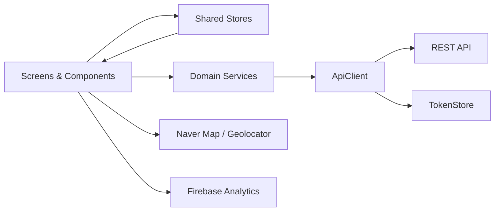

<div align="center">
  
  <h1>문틈 (Muntum)</h1>
  <p><strong>취향과 위치를 연결해 일상 속 문화 프로그램을 발견하는 모바일 서비스</strong></p>
  <p>Flutter · REST API · Naver Map · Firebase Analytics</p>
</div>

## 프로젝트 소개

문틈은 전시, 공연, 체험처럼 주변에 흩어져 있는 문화 프로그램을 한곳에서 탐색하는 iOS·Android 애플리케이션입니다. 사용자가 선택한 취향 키워드를 기반으로 프로그램을 추천하고, 현재 위치 주변의 프로그램을 지도에서 확인하거나 관심 있는 프로그램을 스크랩할 수 있습니다.

단순한 목록형 정보 제공을 넘어 다음 질문을 해결하는 데 집중했습니다.

- 나의 취향과 잘 맞는 문화 프로그램은 무엇인가?
- 지금 내 주변에서 참여할 수 있는 프로그램은 어디에 있는가?
- 발견한 프로그램을 나중에 다시 확인하려면 어떻게 해야 하는가?

| 항목        | 내용                                 |
| ----------- | ------------------------------------ |
| 개발 기간   | 2026.06 ~ 진행 중                    |
| 담당 영역   | Flutter 클라이언트 설계 및 구현 전반 |
| 지원 플랫폼 | iOS 15.0 이상, Android               |
| 디자인 기준 | 390 × 844, responsive UI             |
| 앱 버전     | 1.0.4                                |

## 핵심 기능

| 기능               | 구현 내용                                                                                                        |
| ------------------ | ---------------------------------------------------------------------------------------------------------------- |
| 취향 기반 탐색     | 온보딩에서 키워드를 선택하고, 서버가 제공하는 추천 순서를 유지하면서 프로그램별 키워드 일치 정도를 시각화합니다. |
| 전체 프로그램 피드 | 인기 프로그램, 인기 키워드, 종료 임박 프로그램과 필터·pagination을 제공합니다.                                   |
| 검색               | 제목, 상세 설명, 주소, 예약 여부, 연락처 등 여러 필드를 검색하고 최근 검색어를 서버와 동기화합니다.              |
| 지도 탐색          | 현재 화면 영역의 프로그램을 자동 로드하고, 줌 레벨에 따라 클러스터와 개별 마커를 전환합니다.                     |
| 프로그램 상세      | 운영 기간, 장소, 가격, 예약 정보, 연락처, 공식 링크와 큐레이션 정보를 제공합니다.                                |
| 스크랩             | 홈·검색·상세·지도에서 동일한 스크랩 상태를 공유하며 별도의 스크랩 목록을 제공합니다.                             |
| 사용자 제보        | 장소 검색을 포함한 문화 프로그램 제보, 처리 상태 확인 및 제보 내역 관리를 지원합니다.                            |
| 계정 관리          | 회원가입, 로그인, 토큰 기반 세션 복구, 비밀번호 재설정, 닉네임·취향 수정 및 회원 탈퇴를 지원합니다.              |
| 운영 기능          | 프로그램 등록·수정·삭제, 제보 상태 관리, 공지사항 및 사용자 관리 화면을 구현했습니다.                            |
| 행동 분석          | 홈 탭 조회, 상세 조회, 스크랩 전환, 외부 링크 클릭을 Firebase Analytics 이벤트로 수집합니다.                     |

## 주요 기술적 구현

### 1. 줌 레벨 기반 지도 클러스터링

지도 이동과 확대가 잦은 사용 흐름에서 매번 API를 호출하면 불필요한 네트워크 비용과 마커 깜빡임이 발생합니다. 이를 줄이기 위해 다음과 같이 구성했습니다.

- 지도 진입 시 현재 화면 bounds를 기준으로 프로그램 자동 조회
- 줌 레벨별 거리 임계값을 적용한 client-side clustering
- 줌 단계가 실제로 변경된 경우에만 기존 데이터로 마커 재계산
- 충분히 확대하면 API 재호출 없이 클러스터를 개별 마커로 전환
- 클러스터·마커 선택 시 해당 좌표로 카메라 포커싱
- 마커 이미지와 선택 상태 아이콘을 캐시하여 stroke 변경 지연 최소화
- async render generation과 queue를 관리하여 오래된 결과가 최신 선택 상태를 덮어쓰는 문제 방지

### 2. 일관된 스크랩 상태와 optimistic update

같은 프로그램이 홈, 검색, 지도, 상세, 스크랩 화면에 동시에 나타날 수 있으므로 화면별 로컬 상태만으로는 일관성을 유지하기 어렵습니다.

- `ProgramScrapStore`를 single source of truth로 사용
- 사용자의 조작을 UI에 즉시 반영하는 optimistic update 적용
- API 실패 시 이전 상태로 rollback하고 오류 피드백 제공
- 스크랩 화면 활성화 시 서버 데이터를 다시 동기화
- 로그인하지 않은 사용자는 로그인 유도 바텀시트로 분기

### 3. 인증 세션 복구와 API 계층 분리

`ApiClient`에 공통 HTTP 동작을 모으고 화면은 도메인별 Service만 사용하도록 분리했습니다.

- GET·POST·PUT·PATCH·DELETE 및 multipart 업로드 공통 처리
- Bearer 토큰 자동 첨부
- 401 응답 시 refresh token으로 세션을 갱신하고 요청을 1회 retry
- 공통 응답과 오류를 `ApiResponse`, `PageResponse`, `ApiException`으로 모델링
- 앱 시작 시 세션, 닉네임, 취향 키워드 설정 여부에 따라 진입 화면 결정
- access token은 메모리, 세션 복구 정보는 로컬 저장소에서 관리

### 4. 취향 데이터 기반 UI

서버 추천 결과와 사용자의 선택 키워드를 결합해 추천 이유를 UI에서 이해할 수 있도록 했습니다.

- 선택 키워드와 프로그램 키워드의 교집합 계산
- 최대 3단계의 취향 일치 레벨로 변환
- 추천 피드에서는 서버가 계산한 순서를 보존
- 키워드 변경 시 관련 화면이 즉시 갱신되도록 `UserPreferenceStore`로 동기화

### 5. 분석 가능한 이벤트 설계

Firebase Analytics의 이벤트 이름은 사용자 행동 단위로 유지하고, 세부 맥락은 low-cardinality parameter로 분리했습니다.

| 이벤트                      | 주요 매개변수                                | 목적                                |
| --------------------------- | -------------------------------------------- | ----------------------------------- |
| `home_tab_view`             | `tab_name`                                   | `my_taste`, `all` 탭별 조회 분석    |
| `program_detail_view`       | `program_type`, `entry_source`, `program_id` | 상세 진입 경로와 프로그램 유형 분석 |
| `scrap_add`, `scrap_remove` | `program_type`, `entry_source`, `program_id` | 발견 경로별 스크랩 전환 분석        |
| `external_link_click`       | `link_type`, `entry_source`                  | 문의·예약 등 외부 이동 분석         |

분석 이벤트 실패가 핵심 사용자 흐름을 중단하지 않도록 Analytics 호출은 공통 서비스에서 예외를 격리했습니다.

## 아키텍처



프로젝트는 기능별 화면과 재사용 component, domain service, API layer, shared store를 분리한 구조입니다. 대규모 state management 패키지에 의존하지 않고 `ChangeNotifier`와 명시적인 data flow를 사용해 현재 규모에 맞는 복잡도를 유지했습니다.

```text
lib/
├── api/          # HTTP 클라이언트, 엔드포인트, 응답·예외, 토큰 저장소
├── components/   # 버튼, 카드, 필터 등 공통 UI
├── constants/    # 색상, 타이포그래피, 간격 등 디자인 토큰
├── data/         # 외부 장소 검색 Repository
├── gates/        # 인증 상태에 따른 앱 진입 분기
├── models/       # 프로그램, 인증, 키워드, 공지, 제보 모델
├── screens/      # 홈, 검색, 지도, 스크랩, 상세, 마이페이지, 운영 화면
├── services/     # 인증, 프로그램, 취향, 스크랩 등 도메인 API
├── stores/       # 화면 간 공유 상태
└── utils/        # 스크랩, 검색, 키워드 매칭 등의 공통 로직
```

## 기술 스택

| 구분                 | 기술                                 | 사용 목적                                    |
| -------------------- | ------------------------------------ | -------------------------------------------- |
| Language / Framework | Dart, Flutter                        | iOS·Android 단일 코드베이스                  |
| Networking           | `dart:io` `HttpClient`               | REST API 및 multipart 통신                   |
| Map / Location       | Naver Map, Geolocator                | 지도 탐색, 현재 위치, 장소 검색              |
| Analytics            | Firebase Analytics                   | 사용자 행동 및 진입 경로 분석                |
| Local persistence    | SharedPreferences                    | 세션 복구 정보 및 로컬 사용자 상태 저장      |
| UI                   | ScreenUtil Plus, Flutter SVG, Lottie | responsive UI, vector icon, Lottie animation |
| External action      | URL Launcher, Image Picker           | 외부 링크 실행 및 이미지 첨부                |
| Test                 | Flutter Test                         | 도메인 로직과 주요 화면 상호작용 검증        |

## 테스트

현재 테스트에서는 다음 동작을 검증합니다.

- 지도 반경 내 프로그램 판별
- 취향 키워드 일치 개수와 정렬
- 프로그램의 복합 검색·필터 조건
- 스크랩 및 사용자 키워드 Store 동기화
- 장소 검색 Repository
- 제보 화면에서 장소 검색 화면으로 이동하는 위젯 상호작용

```bash
flutter test
dart analyze lib
```

## 실행 방법

### 요구 사항

- Flutter SDK 및 Dart `^3.12.2`
- iOS 15.0 이상을 지원하는 Xcode / CocoaPods
- Android SDK
- Naver Cloud Platform Maps API 키
- Firebase 프로젝트 설정 파일
- 문틈 REST API 서버 접근 권한

### 환경 변수

프로젝트 루트에 `.env` 파일을 생성합니다. 실제 키는 저장소에 커밋하지 않습니다.

```dotenv
NAVER_MAP_CLIENT_ID=your_client_id

# 장소 검색 기능을 사용하는 경우
NAVER_MAP_CLIENT_SECRET=your_client_secret
NAVER_PLACES_API_CLIENT_ID=your_search_client_id
NAVER_PLACES_API_CLIENT_SECRET=your_search_client_secret
```

> `.env`를 Flutter asset으로 포함하면 앱 패키지에서 값을 추출할 수 있습니다. 위 secret 값은 로컬 개발용 설정이며, 운영 환경에서는 장소 검색 요청을 backend proxy로 이전해야 합니다.

Firebase를 별도 프로젝트로 실행할 경우 아래 플랫폼 설정 파일을 교체하고 FlutterFire 설정도 갱신해야 합니다.

```text
android/app/google-services.json
ios/Runner/GoogleService-Info.plist
lib/firebase_options.dart
```

### 설치 및 실행

```bash
flutter pub get
flutter run
```

## 개선 계획

- refresh token을 플랫폼 보안 저장소로 이전
- 외부 장소 검색 secret과 호출 로직을 backend proxy로 이전
- service와 API layer의 dependency injection 범위 확대
- 지도·인증·pagination에 대한 unit test 및 integration test 보강
- Analytics 데이터를 활용한 추천·스크랩 퍼널 대시보드 구축
- 네트워크 실패 및 offline 환경을 위한 caching strategy 고도화

## 개발자

- James Lee — Flutter Client
- GitHub: [@James1412](https://github.com/James1412)
