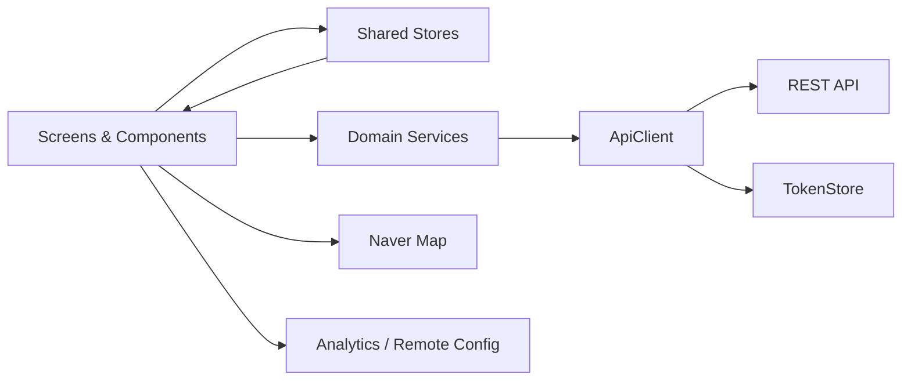

<div align="center">
  
  <h1>문틈 - 문화의 틈</h1>
  <p><strong>내 취향과 가까운 문화생활을 발견하는 가장 간단한 방법</strong></p>
  <p>Flutter · iOS · Android · Naver Map · Firebase</p>
  <p>
    <a href="https://play.google.com/store/apps/details?id=co.digniche.muntum">
      
    </a>
    <a href="https://apps.apple.com/ca/app/%EB%AC%B8%ED%8B%88-%EB%AC%B8%ED%99%94%EC%9D%98-%ED%8B%88/id6789416280">
      
    </a>
  </p>
</div>

## 문틈은 어떤 서비스인가요?

서울에는 전시, 공연, 체험, 축제가 매일 열리지만 정보가 여러 기관과 예매처에 흩어져 있습니다. 문틈은 이 정보를 한곳에 모으고, 사용자의 취향과 현재 위치를 기준으로 지금 가볼 만한 문화 프로그램을 보여주는 모바일 애플리케이션입니다.

문틈은 많은 기능을 보여주는 것보다 다음 한 가지 문제를 해결하는 데 집중합니다.

> 문화생활을 자주 즐기지 않는 사람도 적은 탐색과 터치만으로 자신에게 맞는 프로그램을 발견할 수 있어야 한다.

| 항목 | 내용 |
| --- | --- |
| 지원 플랫폼 | iOS 15 이상, Android |
| 기준 해상도 | 390 × 844, 반응형 UI |
| 클라이언트 | Flutter / Dart |
| 현재 버전 | <!-- APP_VERSION -->1.0.8 (8)<!-- /APP_VERSION --> |
| 담당 | Flutter 클라이언트 설계 및 구현 |

## 주요 기능

### 내취향

- 사용자가 선택한 키워드에 맞는 프로그램을 카드 형태로 추천합니다.
- 프로그램 키워드 중 내 키워드와 일치하는 항목을 강조해 추천 이유를 보여줍니다.
- 필터를 통해 무료, 이번 주, 예약 없이 참여 가능한 프로그램과 유형별 프로그램을 탐색할 수 있습니다.
- 키워드가 부족할 때 편집 화면으로 바로 이동해 추천 범위를 넓힐 수 있습니다.

### 전체

- 최신 프로그램과 인기 프로그램, 유형별 프로그램, 종료 임박 프로그램을 섹션별로 제공합니다.
- 전시, 공연, 체험, 축제 등의 유형별 목록과 페이지네이션을 지원합니다.
- 프로그램의 종료 여부를 카드와 상세 화면에서 일관되게 표시합니다.

### 지도

- 현재 지도 영역을 기준으로 주변 프로그램을 조회합니다.
- 줌 레벨과 마커 간 거리에 따라 클러스터와 개별 마커를 전환합니다.
- 같은 장소의 프로그램도 충분히 확대하면 각각 확인할 수 있습니다.
- 상세 화면의 주소를 누르면 해당 프로그램만 표시한 지도 화면으로 이동합니다.

### 검색과 스크랩

- 제목뿐 아니라 장소, 주소, 상세 내용, 예약 정보 등을 함께 검색합니다.
- 키워드를 여러 개 선택해 조건을 조합할 수 있습니다.
- 최근 검색어는 로그인 상태에 따라 사용자별 로컬 저장소와 서버 조회 결과를 함께 사용합니다.
- 홈, 검색, 지도, 상세 화면에서 동일한 스크랩 상태를 공유합니다.

### 프로그램 상세와 기록

- 위치, 기간, 시간, 가격, 예약 여부, 연락처와 공식 링크를 제공합니다.
- 마크다운 기반 큐레이션 콘텐츠와 관련 프로그램을 함께 보여줍니다.
- 다녀온 프로그램을 `좋았어요` 또는 `아쉬웠어요`로 기록하고 별도 목록에서 확인할 수 있습니다.
- 주소 복사, 외부 링크 이동, 지도 연결을 지원합니다.

### 계정과 운영

- 이메일 로그인과 Apple 로그인을 지원합니다.
- Apple 로그인은 SHA-256 nonce 검증과 재인증 기반 회원 탈퇴 흐름을 사용합니다.
- 프로그램 제보와 내 제보 내역 조회를 지원합니다.
- 관리자 계정은 프로그램, 공지사항, 제보 상태와 사용자 정보를 관리할 수 있습니다.
- Firebase Remote Config를 통해 선택 업데이트와 강제 업데이트를 안내합니다.

## 제품 원칙

- 서비스 아이디어는 넓게 펼치기보다 해결할 문제 하나를 명확하게 정의합니다.
- 사용자가 원하는 결과에 도달하기까지 필요한 터치와 선택을 최소화합니다.
- 화려함보다 이해하기 쉽고 반복해서 사용하기 편한 UI를 우선합니다.
- 로그인과 온보딩은 서비스 사용에 꼭 필요한 시점에만 요구합니다.
- 구현 편의보다 실제 사용자의 흐름을 기준으로 기능을 판단합니다.

## 기술적 구현

### 지도 클러스터링

지도 이동 때마다 모든 마커를 다시 만들지 않도록 조회와 렌더링을 분리했습니다.

- 현재 viewport bounds를 사용한 지도 API 조회
- 줌 레벨별 거리 임계값을 적용한 클라이언트 클러스터링
- 동일 좌표 프로그램의 개별 마커 배치
- 마커 이미지 캐시와 비동기 렌더링 작업 순서 관리
- 선택 상태가 오래된 렌더링 결과로 덮어쓰이지 않도록 요청 상태 검증

### 화면 간 상태 일관성

같은 프로그램이 여러 화면에 동시에 노출되므로 공통 Store를 단일 상태 출처로 사용합니다.

- `ProgramScrapStore`: 화면 간 스크랩 상태 공유
- `UserPreferenceStore`: 사용자 키워드와 취향 상태 공유
- optimistic update 적용 후 API 실패 시 이전 상태로 복구
- 화면 활성화와 로그인 상태 변경 시 필요한 데이터만 재동기화

### 인증과 API 계층

- 화면은 도메인별 Service를 호출하고 공통 HTTP 동작은 `ApiClient`가 처리합니다.
- Bearer access token 첨부, refresh token 기반 세션 복구와 1회 재요청을 지원합니다.
- 응답, 페이지네이션과 오류를 `ApiResponse`, `PageResponse`, `ApiException`으로 모델링했습니다.
- Apple identity token, authorization code와 hashed nonce를 백엔드에 전달합니다.

### 앱 업데이트 정책

- Android는 `versionCode`인 build number를 기준으로 업데이트 여부를 비교합니다.
- iOS는 사용자에게 노출되는 semantic version을 기준으로 비교합니다.
- 최신 버전과 최소 지원 버전을 분리해 권장 업데이트와 강제 업데이트를 제어합니다.
- 세부 설정은 [Remote Config 업데이트 문서](docs/update_remote_config.md)에서 확인할 수 있습니다.

### 사용자 행동 분석

Firebase Analytics 이벤트에 진입 경로를 함께 기록해 어떤 화면에서 상세 조회와 스크랩이 발생했는지 구분합니다.

| 이벤트 | 주요 정보 |
| --- | --- |
| `home_tab_view` | 내취향·전체 탭 조회 |
| `program_detail_view` | 프로그램 유형, 진입 화면, 프로그램 ID |
| `scrap_add`, `scrap_remove` | 스크랩 발생 위치와 프로그램 정보 |
| `external_link_click` | 문의·예약·공식 링크 이동 경로 |

분석 이벤트 실패가 핵심 기능을 중단하지 않도록 Analytics 오류는 서비스 내부에서 격리합니다.

## 아키텍처


```mermaid
flowchart LR
    UI["Screens & Components"] --> Store["Shared Stores"]
    UI --> Service["Domain Services"]
    Store --> UI
    Service --> Client["ApiClient"]
    Client --> API["REST API"]
    Client --> Token["TokenStore"]
    UI --> Map["Naver Map"]
    UI --> Firebase["Analytics / Remote Config"]
```

대규모 상태 관리 패키지를 추가하기보다 현재 프로젝트 규모에 맞춰 `StatefulWidget`, `ChangeNotifier`와 명시적인 데이터 흐름을 사용합니다.

```text
lib/
├── api/          # API client, endpoint, response, exception, token
├── components/   # 공통 버튼, 카드, 앱바, 필터, 다이얼로그
├── constants/    # 색상, 타이포그래피, 간격, radius
├── data/         # 외부 장소 검색 repository
├── gates/        # 인증 및 업데이트 진입 분기
├── models/       # 프로그램, 사용자, 키워드, 제보, 공지 모델
├── screens/      # 홈, 지도, 스크랩, 상세, 프로필, 관리자 화면
├── services/     # 도메인별 API와 외부 서비스
├── stores/       # 화면 간 공유 상태
└── utils/        # 검색, 스크랩, 키워드 매칭 등 공통 로직
```

## 기술 스택

| 구분 | 기술 |
| --- | --- |
| App | Flutter, Dart |
| Network | `dart:io` `HttpClient`, REST API |
| Map / Location | Flutter Naver Map, Geolocator |
| Authentication | JWT, Sign in with Apple, SHA-256 nonce |
| Firebase | Analytics, Remote Config |
| Local storage | SharedPreferences |
| UI | ScreenUtil Plus, Flutter SVG, Flutter Markdown, Lottie |
| External action | URL Launcher, Image Picker |
| Test | Flutter Test |

## 로컬 실행

### 요구 사항

- Flutter SDK와 Dart `^3.12.2`
- Xcode, CocoaPods와 iOS 15 이상 SDK
- Android SDK
- Naver Maps Client ID
- Firebase 플랫폼 설정 파일
- 문틈 API 서버 접근 권한

### 환경 설정

프로젝트 루트에 `.env`를 생성합니다. 실제 키는 저장소에 커밋하지 않습니다.

```dotenv
NAVER_MAP_CLIENT_ID=your_client_id

# 프로그램 제보의 장소 검색 기능을 로컬에서 사용하는 경우
NAVER_MAP_CLIENT_SECRET=your_client_secret
NAVER_PLACES_API_CLIENT_ID=your_search_client_id
NAVER_PLACES_API_CLIENT_SECRET=your_search_client_secret
```

Firebase 프로젝트를 변경할 경우 다음 파일도 함께 교체해야 합니다.

```text
android/app/google-services.json
ios/Runner/GoogleService-Info.plist
lib/firebase_options.dart
```

### 실행 및 검증

```bash
flutter clean
flutter pub get
flutter run

flutter analyze
flutter test
```

### 배포 빌드

```bash
# Google Play
flutter build appbundle --release

# App Store / TestFlight
flutter build ipa --release
```

## 버전 동기화

앱 버전의 기준은 `pubspec.yaml`입니다. 다음 명령은 README의 버전 마커를 현재 앱 버전과 동기화합니다.

```bash
dart run tool/sync_readme_version.dart
```

커밋 전에 자동 실행하려면 저장소의 Git hook을 활성화합니다.

```bash
git config core.hooksPath .githooks
```

## 개발자

- James Lee — Flutter Client
- GitHub: [@James1412](https://github.com/James1412)
